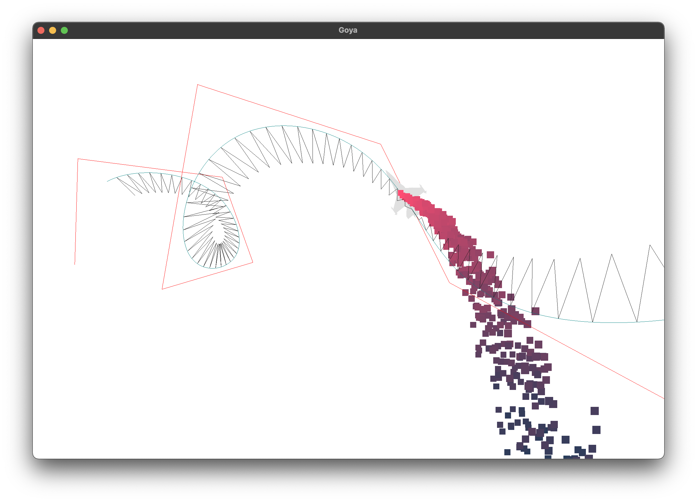

# Goya
Computer animation laboratory exercises writen in c++17 using OpenGL. The repo was named after Spanish romantic painter Francisco José de Goya due to the depressive nature of any mandatory work.



## Features
  * B-Spline driven animation
  * Particle effect system

### Dependencies
  * glm
  * glfw3 
  * OpenGL
  * GLEW

  * c++17 compatible compiler

### How to build
```shell
  cmake -H./ -B./build && cmake --build build
```
